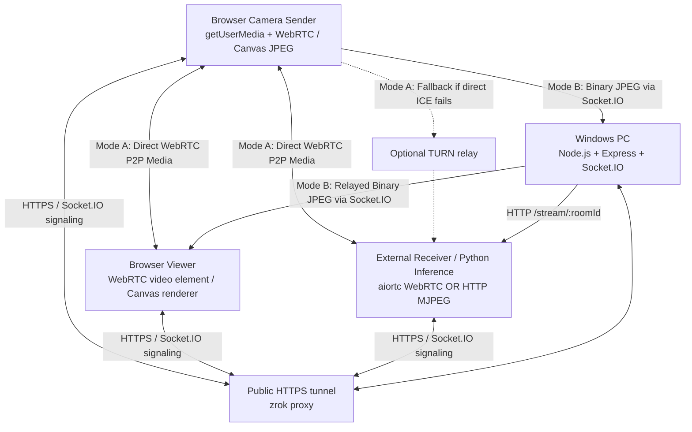

# LAN Camera Streaming — Architecture

## 1. System context

The Windows PC hosts the application. Browsers use it for the sender/viewer UI and signaling. The server does not process or store video in the normal path.



This Node.js repository provides two distinct, selectable media transport modes:
1. **Mode A: WebRTC Mode (Direct/ICE Media)**: Camera video travels directly peer-to-peer between browsers or via TURN relay. The Windows server and zrok tunnel carry signaling only.
2. **Mode B: Experimental zrok-Tunneled Video Mode (Application Relay)**: Camera frames are downscaled via Canvas, binary JPEG encoded, and deliberately routed through the Windows Node.js server to the authorized viewer to test throughput and latency against the zrok free transfer allowance (5 GB daily).

Any external receiving application (such as an external Python `aiortc` client running OpenCV, PyTorch, or YOLO in a separate project) connects via:
1. **WebRTC (`aiortc`)**: Negotiates directly through Socket.IO signaling to receive the camera media track peer-to-peer.
2. **HTTP MJPEG**: Reads standard multipart/x-mixed-replace stream from `/stream/:roomId?pin=...`.

## 2. Components and responsibilities

### 2.1 Node.js application server

- Starts the Express HTTP server and attaches Socket.IO to the same HTTP server.
- Serves the sender and viewer HTML/CSS/JavaScript assets.
- Creates and tracks temporary rooms and peer membership in memory for the MVP.
- Validates room IDs, pairing secrets, membership, and signaling message sender/recipient.
- Relays small WebRTC signaling payloads only; it must not accept or forward raw video frames.
- Removes stale peers and rooms after disconnects and timeouts.
- Does not persist camera content or room secrets to disk.

### 2.2 Sender browser

- Requests camera permission only after a user gesture.
- Calls `navigator.mediaDevices.getUserMedia()` with a video-only constraint for MVP.
- Displays a local preview and stream status.
- Creates an `RTCPeerConnection`, adds the video track, and exchanges SDP/ICE information through Socket.IO.
- Calls `MediaStreamTrack.stop()` and closes the peer connection on Stop, page teardown, or unrecoverable failure.
- Reports actual track settings and connection state for diagnostics.

### 2.3 Viewer browser

- Joins a room using the room ID and secret/PIN.
- Creates an `RTCPeerConnection` and responds to an offer with an answer.
- Adds received tracks to a `MediaStream` and assigns it to the viewer `<video>` element.
- Provides mute/unmute audio controls only if audio is added in a future scope; the MVP is video-only.
- Shows meaningful states such as Waiting for sender, Connecting, Live, Reconnecting, and Disconnected.
- Closes its peer connection and removes listeners when leaving a room.

### 2.4 Socket.IO signaling & Experimental Tunnel Relay

Socket.IO acts as:
1. **Control & Signaling Channel**: Exchanges room join requests, peer notifications, SDP offer/answer, ICE candidates, and lifecycle state.
2. **Experimental Tunnel Relay (Mode B)**: In `tunnel-relay` mode, accepts raw binary JPEG buffers (`tunnel:frame`), validates magic bytes and frame sizes (<=600KB), drops stale frames under backpressure when incoming rate exceeds max FPS, routes directly to the authorized viewer in the room, and records throughput statistics.

Validate every event on the server. A client must not be allowed to send signaling or video payloads to peers outside its authorized room.

### 2.5 zrok Tunnel Provider

`zrok` publishes the local Express application over a secure public HTTPS URL (`https://<hash>.share.zrok.io`).
- In **Mode A**, zrok carries the initial web page delivery and Socket.IO signaling. WebRTC media flows directly peer-to-peer or via TURN.
- In **Mode B**, zrok proxies all web traffic, Socket.IO connections, and binary video frame relays, enabling direct experimentation against zrok's free daily quota (5 GB).

### 2.6 Optional TURN server

TURN is not required for same-LAN WebRTC streaming. Add it if testing shows that direct connectivity fails on restrictive networks. Mode B (tunneled relay) serves as an alternative application-level relay through the Windows server.

## 3. Proposed routes and pages

| Path | Purpose |
|---|---|
| `/` | Minimal landing page with links to sender/viewer |
| `/sender` | Camera preview, room creation/join, Start/Stop controls |
| `/viewer` | Room join form and remote video player |
| `/health` | Simple server health check; do not return secrets or internal details |

The public tunnel should expose only the intended app routes. The MVP has no unauthenticated admin dashboard.

## 4. External WebRTC Receiver Signaling Contract (Version 1.0)

This contract defines the exact Socket.IO event protocol for any external client (such as an external Python `aiortc` client in another project) connecting to this Node.js signaling server.

### 4.1 Connection & Authentication
- **Transport**: Socket.IO client (v4.x compatible over WebSocket/Polling).
- **Endpoint**: Base server URL (e.g., `http://<host>:3000` or `https://<zrok-subdomain>.share.zrok.io`).
- **Namespace**: Default (`/`).
- **Authorization**: Required `pin` (matching server `ACCESS_PIN`, minimum 4 characters).
- **Room ID Format**: `^[a-zA-Z0-9_-]{3,32}$`.

### 4.2 Participant Roles
The server enforces a 1-sender and 1-receiver model per room. Canonical role identifiers:
- `camera-sender` (or `sender`): captures and publishes camera stream.
- `webrtc-receiver` (or `viewer`): receives the remote camera stream.

### 4.3 Supported Socket.IO Events

#### 1. `room:join` (Client → Server)
Requests room registration and authentication.
```json
{
  "roomId": "room-abc123",
  "role": "webrtc-receiver",
  "pin": "123456"
}
```
**Server Ack Callback Response**:
```json
{
  "success": true,
  "roomId": "room-abc123",
  "role": "viewer",
  "hasPeer": true,
  "peerSocketId": "socket_xyz"
}
```
If failed:
```json
{
  "success": false,
  "error": "Invalid access PIN"
}
```

#### 2. `peer:joined` (Server → Peer)
Emitted to the other peer when an authorized participant joins the room:
```json
{
  "role": "viewer",
  "peerId": "socket_abc"
}
```

#### 3. `webrtc:offer` (Bidirectional: Peer ↔ Server ↔ Peer)
Relays standard SDP offer payload to the peer in the room:
```json
{
  "sdp": "v=0\r\no=- 1234567 2 IN IP4 127.0.0.1...",
  "type": "offer"
}
```

#### 4. `webrtc:answer` (Bidirectional: Peer ↔ Server ↔ Peer)
Relays standard SDP answer payload to the peer in the room:
```json
{
  "sdp": "v=0\r\no=- 7654321 2 IN IP4 127.0.0.1...",
  "type": "answer"
}
```

#### 5. `webrtc:ice-candidate` (Bidirectional: Peer ↔ Server ↔ Peer)
Relays an ICE candidate:
```json
{
  "candidate": "candidate:1 1 UDP 2130706431 ...",
  "sdpMid": "0",
  "sdpMLineIndex": 0
}
```

#### 6. `stream:state` (Sender → Server → Receiver)
Notifies of explicit stream lifecycle changes:
```json
{
  "state": "live" | "stopped"
}
```

#### 7. `peer:left` (Server → Peer)
Notifies when the counterpart leaves or disconnects:
```json
{
  "role": "sender" | "viewer"
}
```

#### 8. `room:leave` (Client → Server)
Explicit departure from the room. Triggers cleanup and notifies peer.

#### 9. `room:error` (Server → Client)
Returns safe error notification if an unauthorized or malformed event is sent:
```json
{
  "message": "Unauthorized: Not in a room."
}
```

### 4.4 External Receiver Connection Sequence
1. External client establishes Socket.IO connection to `https://<host-or-zrok-url>`.
2. Emits `room:join` with `{ roomId, role: "webrtc-receiver", pin }`.
3. Acknowledged with `hasPeer: true` (or awaits `peer:joined` when sender joins).
4. Sender creates SDP offer and transmits `webrtc:offer` through Socket.IO.
5. Receiver sets remote description, generates SDP answer, and emits `webrtc:answer`.
6. Both peers exchange `webrtc:ice-candidate` events through Socket.IO.
7. WebRTC establishes direct P2P media path (or TURN relay).
8. Remote video track is consumed by the receiver.

### 4.5 Optional HTTP MJPEG Ingestion
As an alternative to WebRTC, external applications can read:
```text
GET /stream/:roomId?pin=<accessPin>
```
Response format: `multipart/x-mixed-replace; boundary=--frame`.
Each part is a complete standard JPEG image.

## 6. HTTPS and LAN topology

- Camera access requires a secure context in supported browsers. Use a trusted HTTPS origin for the sender page.
- For quick development, run one HTTPS tunnel to the local web server. The public URL is internet-reachable unless the tunnel provider/access configuration restricts it; pairing authorization is still required.
- For deployment restricted to a LAN, use a stable private IP or local DNS name and a certificate trusted by every client device. Installing a local CA on mobile devices requires device-specific steps.
- A host firewall rule may be needed for local access. Do not disable the firewall globally.
- Wi-Fi client isolation, guest networks, VPN routing, browser privacy policies, and restrictive NAT can prevent direct media connectivity even when the web page loads.

## 7. Security and privacy requirements

- Use unguessable room identifiers and a secret/PIN; do not treat a public URL as authentication.
- Keep room authorization on the server. Avoid trusting room IDs supplied by a peer without verifying membership.
- Use HTTPS/WSS for the web application and signaling.
- Do not log SDP, ICE candidates, pairing secrets, or sensitive URLs in production logs unless carefully redacted and justified.
- Validate payload types and maximum sizes; rate-limit join/create attempts.
- Expire inactive rooms and remove stale socket memberships.
- Never enable camera capture automatically on page load.
- Stop every acquired media track when the sender stops or leaves.
- Do not record, store, or proxy video in the MVP.
- Do not add router port forwarding as a default setup step.

## 8. Observability and diagnostics

Both sender and viewer clients incorporate a live on-screen diagnostics panel with clipboard copy and clear controls:
- Server health and Socket.IO connected/disconnected state with socket ID;
- Room join state, canonical participant roles, and agreed media transport mode (`webrtc` vs `tunnel-relay`);
- Real-time ICE lifecycle events:
  - Local candidate gathering with human-readable type breakdown (`HOST`, `SRFLX`, `RELAY`), protocol, and IP/mDNS status;
  - Remote candidate arrival logging and early queueing (`pendingRemoteCandidates`);
  - ICE gathering state transitions (`new` → `gathering` → `complete`);
  - Signaling state transitions (`stable` → `have-local-offer` → etc.);
  - Candidate error events (`onicecandidateerror`) detailing errorCode and STUN/TURN host;
  - `RTCPeerConnection.connectionState` and `iceConnectionState`;
- WebRTC active stats polling:
  - Active nominated candidate pair: local candidate type/address vs remote candidate type/address, and RTT (round-trip time in milliseconds);
  - Inbound/outbound frame rate (FPS), dimensions (width x height), and bytes transferred;
- Mode B (Tunnel Relay) diagnostics:
  - Frames sent/received, dropped frames count, average FPS, encode latency in ms, and data consumption rate (MB and projected MB/hr).

Never report `Live` simply because a room was joined. Confirm that a remote track is received and rendered.

## 9. Suggested project layout

```text
lan-camera-streaming/
├── docs/
│   ├── project-overview.md
│   ├── architecture.md
│   ├── roadmap.md
│   ├── tasks.md
│   ├── decisions.md
│   └── ai_handoff.md
├── src/
│   ├── server/             # Express, Socket.IO, room/session services
│   └── public/             # sender/viewer UI assets
├── tests/                  # signaling and room authorization tests
├── .env.example            # non-secret configuration template
├── .gitignore
├── package.json
└── README.md
```

Adjust the layout if the repository already has established conventions; do not duplicate an existing server or project structure.

## 10. Failure handling

- **Camera denied/not available**: show a clear message and leave the sender stopped.
- **Room invalid/expired/full**: reject the join with an actionable message.
- **Peer leaves**: clear the remote video and show Disconnected; allow an explicit retry.
- **ICE fails on Same-LAN with zrok**:
  - *Diagnosis*: Same Wi-Fi connections via public tunnel (e.g. Android + Windows) often fail direct WebRTC when:
    1. Android Chrome obfuscates host candidates with mDNS (`<uuid>.local`), which Windows cannot resolve if multicast UDP 5353 is blocked by router AP isolation or Windows Firewall.
    2. STUN server-reflexive (`srflx`) fallback fails because both devices share the router's public WAN IP, and consumer routers lack NAT Loopback / Hairpinning for UDP.
    3. Windows Defender Firewall classifies the Wi-Fi network as "Public" and blocks unsolicited incoming UDP packets.
  - *Mitigation*: Client displays a clear on-screen diagnosis and directs the user to **Mode B (Experimental zrok Tunnel Relay)**, which transmits frames through the authenticated server WebSocket and operates reliably on any network topology.
- **Server restarts**: all in-memory rooms are lost in the MVP; both peers must create/join a new room.
- **Tunnel URL changes**: clients must reopen the current URL; document this development limitation.
