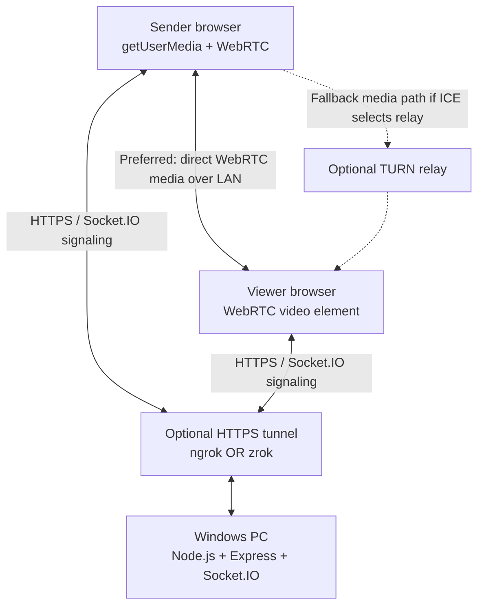

# LAN Camera Streaming — Architecture

## 1. System context

The Windows PC hosts the application. Browsers use it for the sender/viewer UI and signaling. The server does not process or store video in the normal path.



The tunnel is only one way to reach the host's HTTP(S) service. For strict LAN-only use, replace the tunnel with a trusted local HTTPS address/certificate. Do not run both ngrok and zrok unless testing a specific deployment scenario.

## 2. Components and responsibilities

### 2.1 Node.js application server

- Starts the Express HTTP server and attaches Socket.IO to the same HTTP server.
- Serves the sender and viewer HTML/CSS/JavaScript assets.
- Creates and tracks temporary rooms and peer membership in memory for the MVP.
- Validates room IDs, pairing secrets, membership, and signaling message sender/recipient.
- Relays small WebRTC signaling payloads only; it must not accept or forward raw video frames.
- Removes stale peers and rooms after disconnects and timeouts.
- Does not persist camera content or room secrets to disk.

### 2.2 Sender browser

- Requests camera permission only after a user gesture.
- Calls `navigator.mediaDevices.getUserMedia()` with a video-only constraint for MVP.
- Displays a local preview and stream status.
- Creates an `RTCPeerConnection`, adds the video track, and exchanges SDP/ICE information through Socket.IO.
- Calls `MediaStreamTrack.stop()` and closes the peer connection on Stop, page teardown, or unrecoverable failure.
- Reports actual track settings and connection state for diagnostics.

### 2.3 Viewer browser

- Joins a room using the room ID and secret/PIN.
- Creates an `RTCPeerConnection` and responds to an offer with an answer.
- Adds received tracks to a `MediaStream` and assigns it to the viewer `<video>` element.
- Provides mute/unmute audio controls only if audio is added in a future scope; the MVP is video-only.
- Shows meaningful states such as Waiting for sender, Connecting, Live, Reconnecting, and Disconnected.
- Closes its peer connection and removes listeners when leaving a room.

### 2.4 Socket.IO signaling

Socket.IO is a signaling/control channel, not a media transport. It exchanges:

- room creation and join requests;
- peer-ready and stream-state events;
- WebRTC SDP offers and answers;
- ICE candidates;
- leave and failure events.

Validate every event on the server. A client must not be allowed to send signaling payloads to peers outside its authorized room.

### 2.5 Optional tunnel

ngrok or zrok forwards HTTPS/WebSocket requests to the local Node.js server. It makes the UI/signaling reachable through a secure browser origin, but the presence of a tunnel does not mean media flows through it. Verify the selected WebRTC candidate pair during testing rather than assuming the media path.

### 2.6 Optional TURN server

TURN is not required for the first same-LAN proof of concept. Add it if testing shows that direct connectivity fails on target networks. Use short-lived TURN credentials or another suitable credential mechanism; do not ship a public TURN server with static shared credentials.

## 3. Proposed routes and pages

| Path | Purpose |
|---|---|
| `/` | Minimal landing page with links to sender/viewer |
| `/sender` | Camera preview, room creation/join, Start/Stop controls |
| `/viewer` | Room join form and remote video player |
| `/health` | Simple server health check; do not return secrets or internal details |

The public tunnel should expose only the intended app routes. The MVP has no unauthenticated admin dashboard.

## 4. Proposed signaling protocol

Exact payload schemas should be defined in code and validated on both sides. These are conceptual event names for implementation consistency:

| Event | Direction | Purpose |
|---|---|---|
| `room:create` | Sender → server | Request a room and receive a non-guessable room ID plus pairing secret |
| `room:join` | Viewer → server | Join with a valid room ID and secret/PIN |
| `room:joined` | Server → client | Confirm room membership and provide the authorized peer ID |
| `peer:ready` | Server → peer | Notify the other participant that signaling can begin |
| `webrtc:offer` | Offerer → server → recipient | Relay SDP offer to the other authorized peer |
| `webrtc:answer` | Answerer → server → recipient | Relay SDP answer to the other authorized peer |
| `webrtc:ice-candidate` | Either peer → server → recipient | Relay one ICE candidate at a time |
| `stream:state` | Sender → server → viewer | Publish explicit states such as starting/live/stopped |
| `room:leave` | Client → server | Leave the room and notify the other peer |
| `room:error` | Server → client | Return a safe, actionable error code/message |

The server should associate each socket with its authenticated room membership, rate-limit room creation/join attempts, reject oversized or malformed payloads, and never trust a client-supplied recipient without checking membership.

## 5. Connection sequence

1. The sender loads the app over HTTPS and creates or joins a room.
2. The server registers the sender socket and returns the room details.
3. The viewer joins using the room ID and pairing secret/PIN.
4. The server authorizes the viewer and notifies both participants that they are ready.
5. The chosen offerer creates an `RTCPeerConnection`, adds its media track if it is the sender, creates an SDP offer, and sends it through Socket.IO.
6. The other peer applies the offer, creates an SDP answer, and returns it through Socket.IO.
7. Both peers exchange ICE candidates through Socket.IO.
8. ICE selects a viable path. When possible, the video media flows directly between browsers; otherwise a configured relay may be used.
9. The viewer transitions to Live when a remote track is rendered and the connection is usable—not merely when an offer or answer is exchanged.
10. On Stop/Leave/disconnect, close peer connections, stop capture tracks on the sender, update the UI, and clean up server room state.

## 6. HTTPS and LAN topology

- Camera access requires a secure context in supported browsers. Use a trusted HTTPS origin for the sender page.
- For quick development, run one HTTPS tunnel to the local web server. The public URL is internet-reachable unless the tunnel provider/access configuration restricts it; pairing authorization is still required.
- For deployment restricted to a LAN, use a stable private IP or local DNS name and a certificate trusted by every client device. Installing a local CA on mobile devices requires device-specific steps.
- A host firewall rule may be needed for local access. Do not disable the firewall globally.
- Wi-Fi client isolation, guest networks, VPN routing, browser privacy policies, and restrictive NAT can prevent direct media connectivity even when the web page loads.

## 7. Security and privacy requirements

- Use unguessable room identifiers and a secret/PIN; do not treat a public URL as authentication.
- Keep room authorization on the server. Avoid trusting room IDs supplied by a peer without verifying membership.
- Use HTTPS/WSS for the web application and signaling.
- Do not log SDP, ICE candidates, pairing secrets, or sensitive URLs in production logs unless carefully redacted and justified.
- Validate payload types and maximum sizes; rate-limit join/create attempts.
- Expire inactive rooms and remove stale socket memberships.
- Never enable camera capture automatically on page load.
- Stop every acquired media track when the sender stops or leaves.
- Do not record, store, or proxy video in the MVP.
- Do not add router port forwarding as a default setup step.

## 8. Observability and diagnostics

Show or log enough information to diagnose failures without exposing secrets:

- server health and Socket.IO connected/disconnected state;
- room/peer state and safe error codes;
- camera permission or device errors;
- `RTCPeerConnection.connectionState` and `iceConnectionState`;
- negotiated frame dimensions and frame rate where available;
- WebRTC statistics needed to inspect packets, frames, bitrate, packet loss, and selected candidate pair;
- whether the media path is direct or relayed, when this can be determined from WebRTC stats.

Never report `Live` simply because a room was joined. Confirm that a remote track is received and rendered.

## 9. Suggested project layout

```text
lan-camera-streaming/
├── docs/
│   ├── project-overview.md
│   ├── architecture.md
│   ├── roadmap.md
│   ├── tasks.md
│   ├── decisions.md
│   └── ai_handoff.md
├── src/
│   ├── server/             # Express, Socket.IO, room/session services
│   └── public/             # sender/viewer UI assets
├── tests/                  # signaling and room authorization tests
├── .env.example            # non-secret configuration template
├── .gitignore
├── package.json
└── README.md
```

Adjust the layout if the repository already has established conventions; do not duplicate an existing server or project structure.

## 10. Failure handling

- Camera denied/not available: show a clear message and leave the sender stopped.
- Room invalid/expired/full: reject the join with an actionable message.
- Peer leaves: clear the remote video and show Disconnected; allow an explicit retry.
- ICE fails: attempt a bounded recovery/reconnect flow and provide a useful diagnostic. If TURN is not configured, say that relayed connectivity is unavailable rather than silently implying universal internet support.
- Server restarts: all in-memory rooms are lost in the MVP; both peers must create/join a new room.
- Tunnel URL changes: clients must reopen the current URL; document this development limitation.
